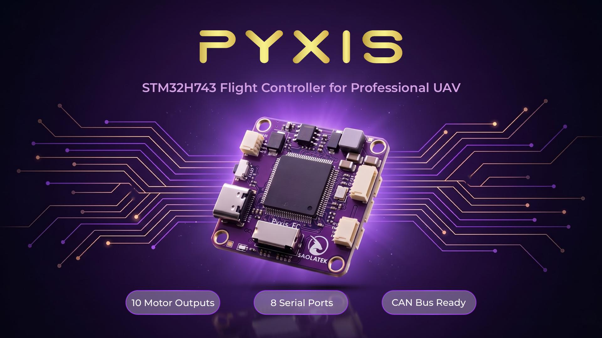

# Pyxis FC


Board support files, build guides and flashing procedures for the **Pyxis** flight controller by Saolatek, covering ArduPilot, INAV, Betaflight and PX4.



## Overview

Pyxis is a 36 × 36 mm flight controller built around the STM32H743VIT6. It is a custom design, so no upstream flight stack includes a target for it. This repository provides:

- An ArduPilot hardware definition with build and flash guides.
- A drop-in INAV target.
- Betaflight board configs and a BMI270 driver patch.
- A complete PX4 board port.
- The pin map, connector drawings and board schematic.

In firmware sources and build commands the board is identified as
**`Saolah743`** in ArduPilot, **`SAOLA_H743`** in INAV, **`SAOLAH743`** /
**`SAOLAH743_BMI270`** in Betaflight, and **`saolah743_h743`** in PX4.

| Firmware | Provided | Build system |
| --- | --- | --- |
| ArduPilot (ArduCopter) | Hardware definition and bootloader patch | waf |
| INAV | Target source and driver patch | CMake |
| Betaflight | Board config and driver patch | make |
| PX4 | Board port and DPS310 driver patch | CMake |

## Key features

- STM32H743VIT6 Cortex-M7, rated to 480 MHz, with 2 MB flash and 1 MB RAM.
- Eight serial ports: seven UARTs plus USB VCP.
- Ten motor outputs with DShot; bidirectional DShot on M1, M3 and M5.
- BMI270 IMU, barometer and IST8310 compass on board.
- AT7456E analog OSD.
- Blackbox logging to microSD.
- 3S–5S LiPo input with voltage and current sensing, 9 V and 5 V regulated rails.
- CAN bus (DroneCAN ready), external I²C and SWD debug header.
- USB DFU flashing, no external programmer required.

## Specifications

| | |
| --- | --- |
| MCU | STM32H743VIT6, Cortex-M7, 480 MHz |
| Memory | 2 MB flash, 1 MB RAM |
| IMU | BMI270 (default) or BMI088 |
| Barometer | DPS310 or DPS368 |
| Magnetometer | IST8310 |
| OSD | AT7456E |
| Input voltage | 3S–5S LiPo (input TVS diode: SM6T27A) |
| Regulators | 9 V TPS54560 buck, 5 V TPS62932 step-down, dedicated LDOs for MCU and IMU |
| Board size | 36 × 36 mm |
| Mounting | 31 × 31 mm |
| Weight | 10 g |

> [!NOTE]
> Boards ship with either a DPS310 or a DPS368 barometer. The two parts share a register map and Product ID, so the current ArduPilot, INAV and PX4 sources drive both with the DPS310 driver. Release `Ardupilot-v0.0.3` supports the DPS310 only, and release `PX4-v0.0.3` comes in two variants (`default` for DPS310, `dps368` for DPS368); check which part is fitted to your board before flashing a release.

## Prerequisites

### Hardware

| Item | Requirement |
| --- | --- |
| Flight controller | Pyxis FC |
| Cable | USB Type-C, data capable |
| Boot mode | Access to the BOOT button |
| Optional | microSD card for logging, SWD probe for debugging |

### Software

| | ArduPilot | INAV | Betaflight | PX4 |
| --- | --- | --- | --- | --- |
| Host OS | Ubuntu 24.04 or WSL2 | Ubuntu or WSL2 | Ubuntu or WSL2 | Ubuntu 24.04 or WSL2 |
| Toolchain | Installed by ArduPilot's setup script | `gcc-arm-none-eabi`, `cmake`, `make` | `gcc-arm-none-eabi`, `make`, or Docker | `gcc-arm-none-eabi`, `cmake`, `ninja-build` |
| Flashing | `dfu-util` | INAV Configurator | Betaflight Configurator or `dfu-util` | STM32CubeProgrammer, `dfu-util` or INAV Configurator for the factory image; QGroundControl for updates |
| Setup | [flashing-setup.md](Docs/flashing-setup.md) | [flashing-setup.md](Docs/flashing-setup.md) | [flashing-setup.md](Docs/flashing-setup.md) | [flashing-setup.md](Docs/flashing-setup.md) |
| Ground station | Mission Planner or QGroundControl | INAV Configurator | Betaflight Configurator | QGroundControl |

## Quick start

**1. Get the firmware.** The easiest way is to download a prebuilt file from
[Releases](../../releases). Pick the newest tag for your flight stack
(`Ardupilot-*`, `BetaFlight-*`, `Inav-*`, `PX4-*`) and extract the zip if there is one.

For a new board, or one running a different flight stack, use the file listed
below. It includes everything the board needs to boot.

| Firmware | File for a new board | Variant to check | Flashing guide |
| --- | --- | --- | --- |
| ArduPilot | `arducopter_with_bl.bin` / `.hex` | DPS310 barometer only | [Flash](Ardupilot/boot-firmware-guided.md) |
| Betaflight | `betaflight_*_SAOLAH743_BMI270.hex` / `.dfu` or `betaflight_*_SAOLAH743.hex` / `.dfu` | `SAOLAH743_BMI270` = BMI270 only, `SAOLAH743` = BMI088 + BMI270 | [Flash](BetaFlight/flash-guided.md) |
| INAV | `inav_*_SAOLA_H743.hex` | None (BMI088/BMI270 and DPS310/DPS368 detected at boot) | [Flash](Inav/Build-guided.md#5-flash) |
| PX4 | `saolah743_h743_<variant>_factory.hex` / `.bin` | `default` = DPS310, `dps368` = DPS368 | [Flash](PX4/flash-guided.md) |

Use `.hex` with a graphical tool (Configurator, STM32CubeProgrammer), and
`.bin` / `.dfu` with `dfu-util`. `dfu-util` cannot read `.hex` files.

Each firmware folder has a `SOURCE.md` that pins the upstream commit and lists
the checksum of every released file. Check a download with `md5sum <file>`
(or `sha256sum <file>` where SOURCE.md lists SHA-256).

To build the firmware yourself instead, follow the build guide:
[ArduPilot](Ardupilot/build-guided.md), [INAV](Inav/Build-guided.md),
[Betaflight](BetaFlight/build-guided.md), [PX4](PX4/build-guided.md).

**2. Set up your computer** (once): install `dfu-util` and the USB drivers as
described in [Docs/flashing-setup.md](Docs/flashing-setup.md). On WSL2 the
board is not visible until it is forwarded with `usbipd`.

**3. Enter DFU mode.**

1. Unplug the USB cable.
2. Press and hold the BOOT button.
3. Plug the board in while holding the button, then release it.

Check that the board is visible:

```bash
sudo dfu-util -l    # lists a device 0483:df11 named "STM32 BOOTLOADER"
```

**4. Flash** using the method in your firmware's flashing guide (links in the table above).

**5. Configure** ports, receiver and battery monitoring as described at the end of each guide.

## Usage

### Wiring

See the [wiring diagram](Docs/images/wiring.jpg) and the [connector layout](Docs/images/connectivity.jpg) for both sides of the board.

| Peripheral | Connector | Port |
| --- | --- | --- |
| RC receiver (SBUS, CRSF, ELRS) | SBUS/CRSF | UART6 |
| GPS and external compass | GPS | UART3, I²C1 |
| Telemetry radio | TELEM1 | UART1 |
| DJI air unit | DJI | UART2 |
| Second telemetry link | TELEM2 | UART2 (shared with DJI, use one or the other) |
| Spare serial | UART4 | UART4 |
| Companion computer | UART8 | UART8 |
| ESC | ESC | M1–M4, UART7 telemetry, current sense |
| Analog VTX | VIDEO-OUT | 9 V |
| FPV camera | VIDEO-IN | 9 V |
| CAN peripherals | CAN | CAN1 |

The MCU pin for every function is listed in the [pin map](Docs/pinout.md).

## License

The four firmware directories are **four separate programs**. Each inherits
the license of its upstream project, so licensing applies **per directory**.
There is no repository-wide license.

| Directory | Upstream | License |
| --- | --- | --- |
| [`Ardupilot/`](Ardupilot/) | ArduPilot | [GPL-3.0-or-later](Ardupilot/LICENSE) |
| [`BetaFlight/`](BetaFlight/) | Betaflight | [GPL-3.0-or-later](BetaFlight/LICENSE) |
| [`Inav/`](Inav/) | INAV | [GPL-3.0-or-later](Inav/LICENSE) |
| [`PX4/`](PX4/) | PX4-Autopilot | [BSD-3-Clause](PX4/LICENSE) |

Aggregating GPL and BSD programs in one repository is permitted under the
*mere aggregation* provision of GPLv3 section 5. Code must not be copied
between directories: GPL code moved into `PX4/` would place that port under
GPLv3 irreversibly.

See [COMPLIANCE.md](COMPLIANCE.md) for source availability, the written offer
for pre-installed firmware, and trademark usage.

"ArduPilot", "Betaflight", "INAV" and "PX4" are marks of their respective
projects. Pyxis is compatible with them; it is not affiliated with or endorsed
by them.

## Contact

Pyxis is designed and manufactured by **Saolatek** in Vietnam.

- Website: [saolatek.vn](https://saolatek.vn)
- Email: [contact@saolatek.vn](mailto:contact@saolatek.vn)
- Phone: +84 978 357 681
- Address: SHTP Incubation Center, D2B St. & D1 St., Long Thanh My Ward, Thu Duc City, Ho Chi Minh City
- Related sites: [vietdrone.vn](https://vietdrone.vn) · [vatomus.com](https://vatomus.com)

For firmware and board-support issues, please use this repository's issue tracker.
